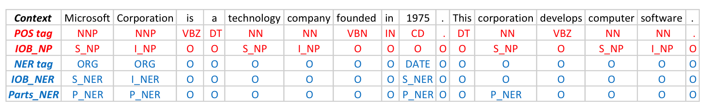
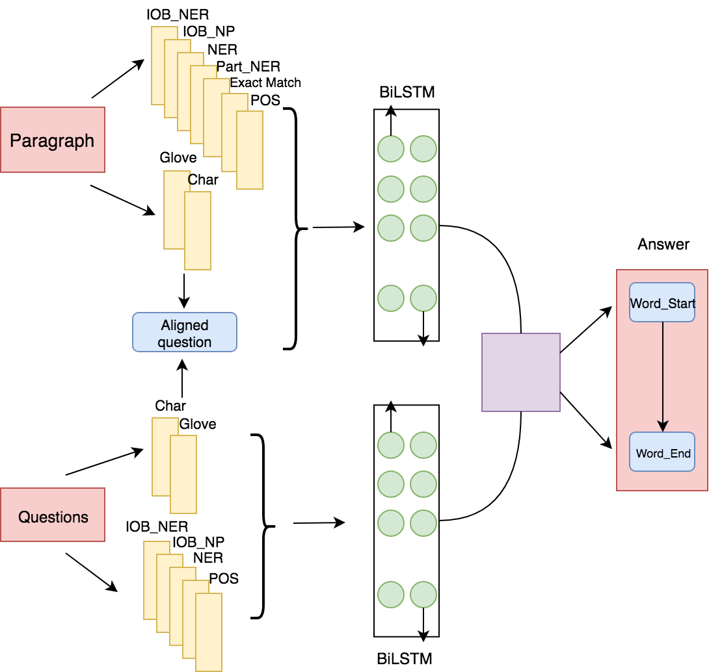
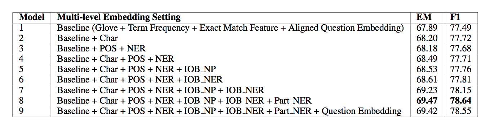

Multi-level Embedding Representation for Reading Comprehension
---
[Paper]: Implementation based on ACL 2017 paper [Reading Wikipedia to Answer Open-Domain Questions](http://www-cs.stanford.edu/people/danqi/papers/acl2017.pdf) (DrQA).     

[Code]: Our original code is adopted from https://github.com/hitvoice/DrQA.    

### Data
We conduct our experiments on SQuAD. [SQuAD](https://rajpurkar.github.io/SQuAD-explorer/) is a reading comprehension benchmark.     

### Our Novel Modification  
- IOB-NER tagging
- IOB-NP tagging
- Part of NER tagging     

Example of different tagging as shown in following figure. We mark S, I, and O to indicate beginning, middle, and outside of named entities or noun phrases on top of POS and NER tags. In this example, Microsoft Corporation is a named entity. We mark Microsoft as S_NER and Corporation as I_NER. For Part of NER tagging, corporation refers to Microsoft Corporation, thus is marked as P_NER.     


### Model Architecture     



### Result     
As shown in following figure, by adding character level embedding, model performance shows improvement. After adding our novel embedding features IOB-NER, IOB-NP, and Part-NER, the model further improved. One interesting finding is that including these IOB features together increases model performance by 0.74%, but adding IOB-NP or IOB-NER alone increases EM score by only 0.04% and 0.12% respectively. After adding Part NER tagging, our best model (Model 8) is able to achieve F1 score at 78.64% and EM score at 69.47%. We also notice that adding question encoding does not contribute much to performance improvement.     



### Requirements
- python 3.5 
- pytorch 0.3
- numpy
- msgpack
- spacy 2.0

### Set up     
to download data and GloVe     
```python
bash download.sh
```     

to download Pre-trained character-level vector     
http://www.logos.t.u-tokyo.ac.jp/~hassy/publications/arxiv2016jmt/jmt_pre-trained_embeddings.tar.gz


### Train

```bash
# prepare the data
python src/prepro.py
# train for 40 epochs with batchsize 32
python src/main.py 
```

### Team     
Xiaoyu Wang, Yidi Zhang, Yihui Wu, Xinsheng Zhang

### Acknowledgement     
Prof. Samuel R. Bowman
